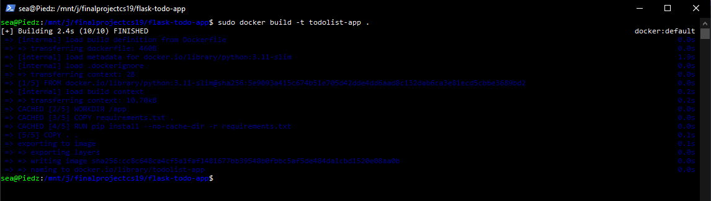
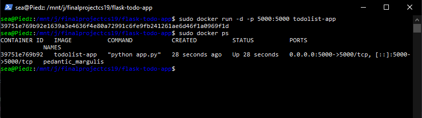
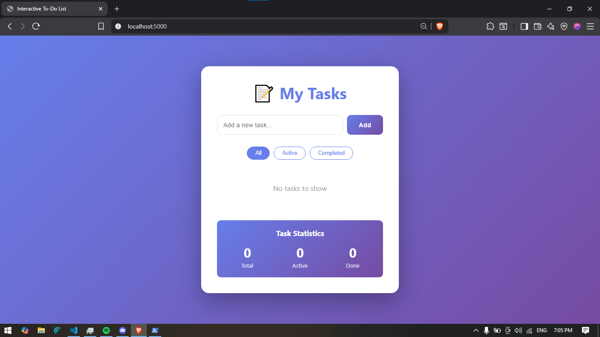
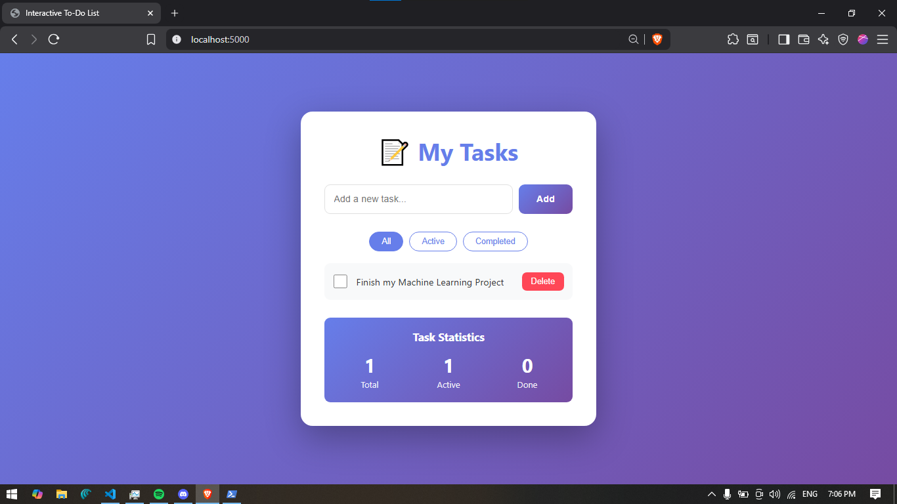
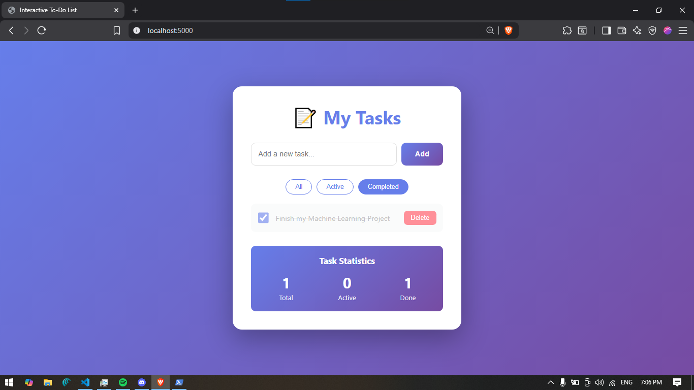

# To-do list application using Flask
This is a simple Flask-based To-Do application that allows users to manage their tasks interactively. The application features a clean user interface and provides functionalities to add, delete, and filter tasks.

## Step-by-step instruction


### Clone the repository
```bash
git clone https://github.com/Saeyuun/Docker-Demonstration-CS19L/edit/main/README.md
```
Then go to its directory
```bash
cd flask-todo-app
```

## Setting up docker
First, we initialize our docker by building it first

```bash
docker build -t todolist-app .
```
or
```bash
sudo docker build -t todolist-app .
```

Then we run:
```bash
sudo docker run -d -p 5000:5000 todolist-app
```

To check if our container is running we run:
```bash
docker ps
```


## Running the application
Simply visit the link:
http://localhost:5000

### Sample screenshots 



